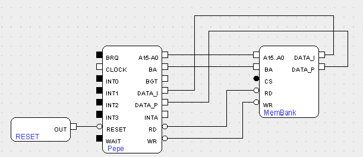

A calory tracking scale programmed in assembly for the PEPE-16 processor. Second project of the Computer Architecture class.

Graded in 18/20.

# Load the PEPE processor in the simulator

# Load the assembly to the PEPE processor

